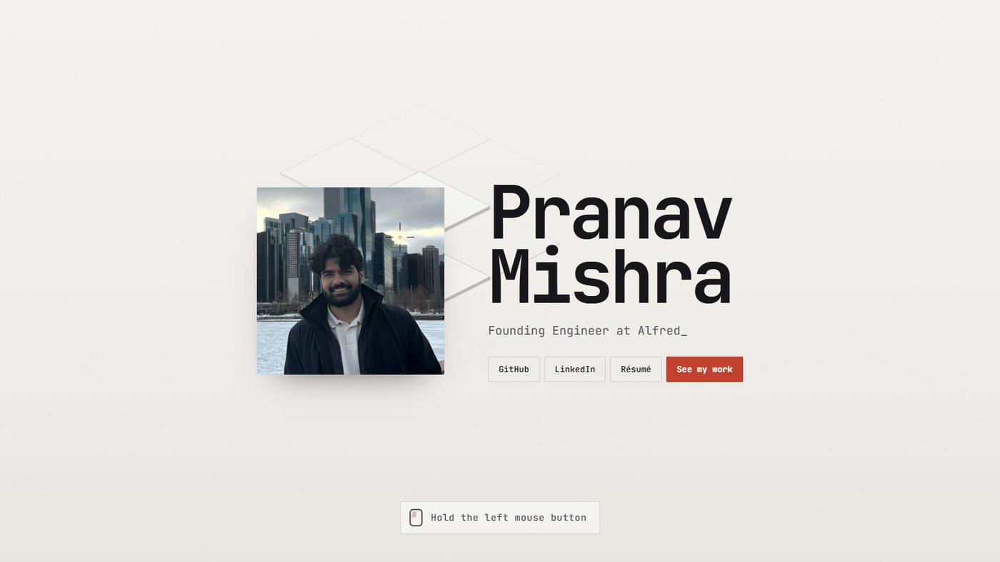
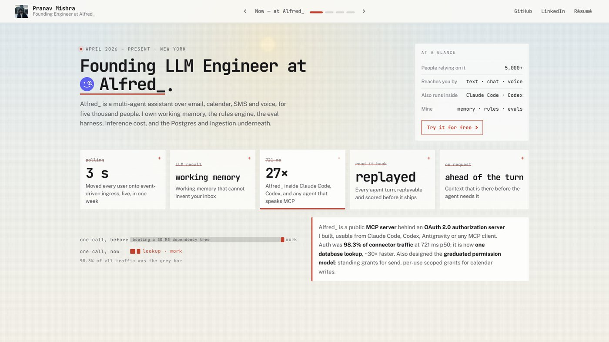
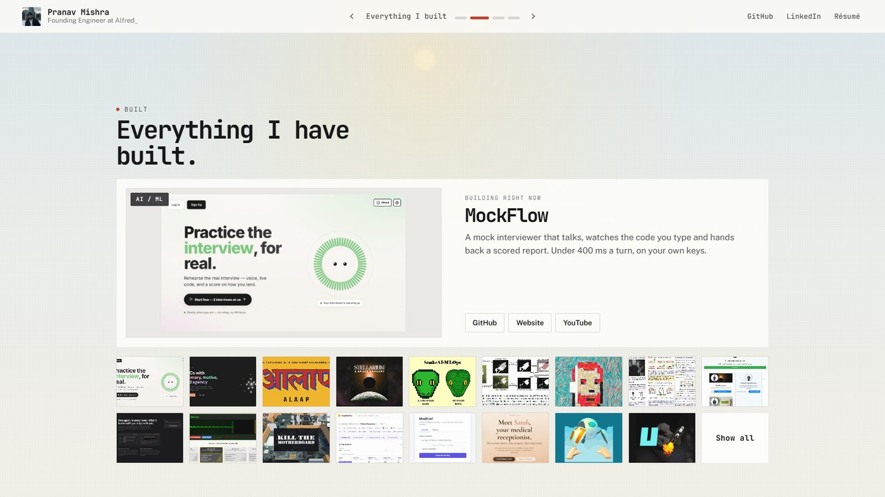
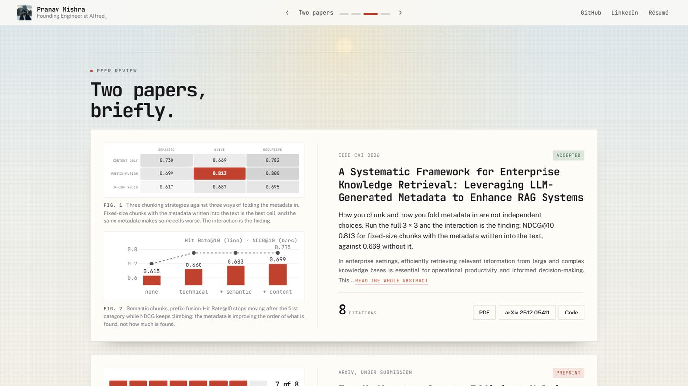
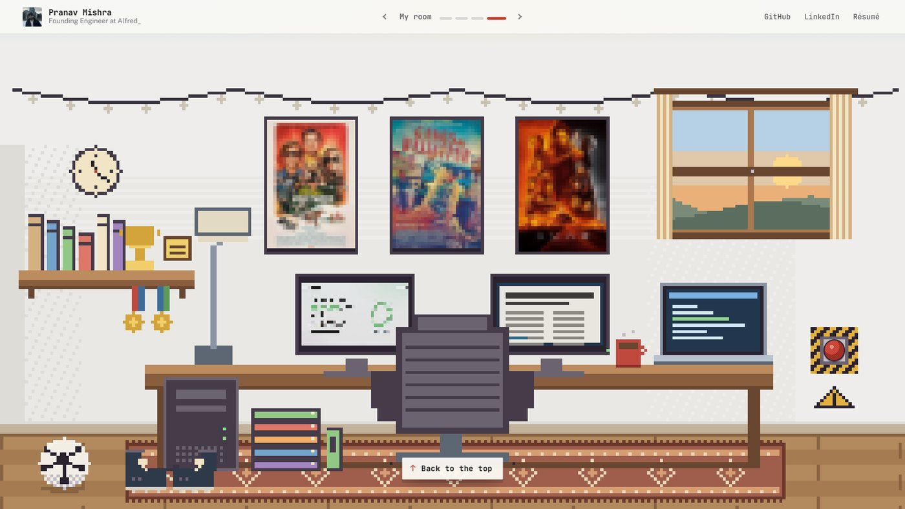
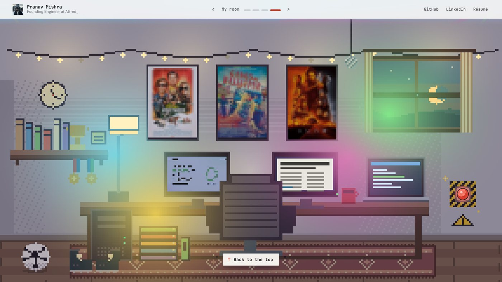
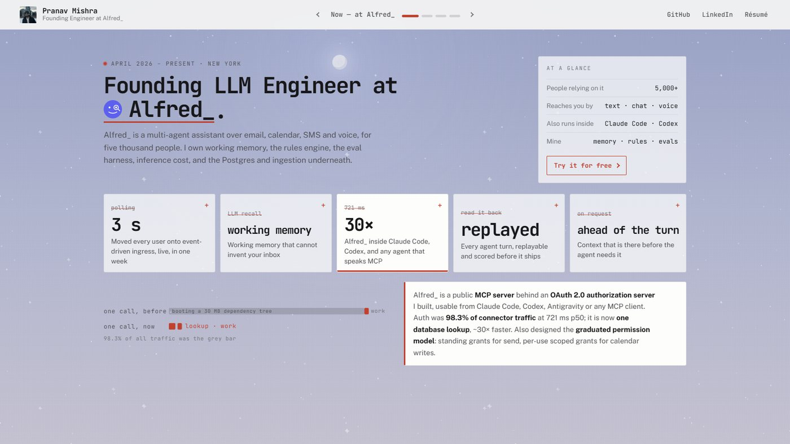

# Portfolio — Pranav Pushkar Mishra

Founding LLM Engineer at Alfred\_. One page, no backend: a wall you have to break, the work at Alfred\_ in five measured figures, thirty projects, two papers, and a pixel room at the bottom that keeps real time.

Live at [pranavmishra17.vercel.app](https://pranavmishra17.vercel.app/).



## What's on the page

**The wall.** The site opens behind a plaster wall. Hold the mouse button and the tiles under the cursor lift, then the whole thing comes apart and the page is underneath. The face in the header puts it back.



**Now.** Alfred\_ takes the first screen: five figures, each a before struck through and an after that counts up. Point at one and its drawing appears; click and the note stays. Below the fold, WheelPrice as a bar with a car on it (point at the car), and the roles before that, folded.



**Everything I built.** Thirty projects from GitHub, ranked. A viewbox cycles through the ones being built right now; the grid opens each into the frame. SoulEngine's tile is a short silent loop.



**Two papers.** Each with two figures drawn from its results, and a third once the abstract is opened.



**The room.** A 288-pixel-wide room drawn into a palette-index buffer every frame and lit for the hour it actually is: the lamp and string lights come on as it gets dark, the window shows the sun or a crescent moon. Everything in it does something. The books, the games and the posters are real (the covers pixelate onto the shelf and clear when you point at them); the chair spins; the clock flips the day; the red button on the wall starts the disco.



**The sky.** The page's background is a gradient for the hour of the day, drifting about an hour and a half from the top of the page to the bottom. By day a soft sun; by night indigo, stars and a moon on the same arc.



## How it is built

React 19, react-router 7, react-scripts 5, plain CSS. No TypeScript, no Tailwind, no server. Fonts from Google Fonts; everything else is in the repo.

- `src/variants/v19/` is the site. `index.js` is the page shell; `copy.js` rewrites the content in `src/data/` at render time (one-liners, renames, the Alfred\_ figures, the paper overrides); `personal.js` is the shelf — books, games, posters, trophies.
- `wall/` is the wall: `iso2.js` cuts the isometric tiles into a sprite atlas once and blits them; `Wall.js` owns the physics of the collapse; `index.js` runs the one loop and the crosshair. A frame identical to the last one is not drawn, so a wall nobody is touching costs nothing.
- `room/` is the room: `engine.js` is the pixel engine (palette indices with day and night values, lights that pull colour back toward day, a hover outline for free), `scene.js` draws it, `Room.js` runs it and handles what you click. The still parts are drawn once and copied in each frame; the room does not draw at all when it is off screen.
- The classic site that came before is kept at [`/classic`](https://pranavmishra17.vercel.app/classic), loaded only if asked for. Prompt Patrol, the LLM-themed shooter, lives there; its design doc is [docs/prompt-patrol-gdd.html](./docs/prompt-patrol-gdd.html).

```
portfolio/
├── public/
│   ├── assets/images/
│   │   ├── web/                     # web-sized project pictures (the ones the site uses)
│   │   ├── room/                    # covers and posters, pixelated onto the room
│   │   ├── companies/               # logos
│   │   └── {ai_ml,game_design,misc}/  # the originals
│   ├── llms.txt
│   └── resumes/{ai,game}/           # local backup of the résumé PDF
├── scripts/
│   ├── stress.js                    # performance and stress harness (see below)
│   └── generate-resume-manifest.js
└── src/
    ├── App.js                       # "/" and "/resume" are v19; "/classic" is the old site
    ├── data/                        # projects.js, experience.js, publications.js,
    │                                # projectsGithub.js, projectImagesWeb.js
    ├── variants/v19/                # the site
    │   ├── index.js  copy.js  personal.js  hooks.js  v19.css  Resume.js
    │   ├── sections/                # Landing, Work, Projects, Papers
    │   ├── wall/                    # Wall.js, iso2.js, index.js
    │   └── room/                    # engine.js, scene.js, Room.js
    ├── MainPortfolio.js             # the classic page
    └── components/                  # the classic page's parts, and Prompt Patrol
```

The "where do I edit X" map for the classic page is in [CLAUDE.md](./CLAUDE.md).

## Quick start

```bash
cd portfolio
npm install
npm start                         # http://localhost:3000
```

| script | what it does |
|---|---|
| `npm run build` | Production build. Bash sets `CI=false`; on Windows CMD use `set CI=false && npx react-scripts build`. |
| `node scripts/stress.js <url> [dpr] [--quick]` | Loads the page in a real Chromium and reports fps, animation loops per frame, JS time per frame, long frames, heap, nodes and listeners across a set of scenes: idle on the wall, a stalled main thread, twenty seconds in a background tab, a resize storm, the blast, the room, three rebuild-and-blast cycles and a soak. Needs `playwright-core` and a Chromium. |
| `npm run resume-manifest` | Scans `public/resumes/{ai,game}/` and writes `manifest.json`. Runs on `prestart` and `prebuild`. |
| `npm test` | Jest via react-scripts. |

## Changing the content

| To change... | Edit |
|---|---|
| A project's one-liner, name or repo link | `src/variants/v19/copy.js` — `LINE`, `RENAME`, `REPO` |
| Which projects show, and in what order | `KEEP` in `copy.js` |
| A project's picture | drop a web-sized copy in `public/assets/images/web/` under a new name and point `src/data/projectImagesWeb.js` at it (the old name stays cached for a week) |
| A project not in `projects.js` | `src/data/projectsGithub.js` |
| The Alfred\_ figures and notes, WheelPrice, the roles | `ALFRED`, `FIGURES`, `WHEELPRICE`, `AFTER_LINE` in `copy.js` |
| Books, games, posters, trophies | `src/variants/v19/personal.js` + the pictures in `public/assets/images/room/` |
| The papers' figures | `FIGURES` in `src/variants/v19/sections/Papers.js` |
| The résumé | the live PDF is in `PranavMishra17/PranavMishra17`; any `.pdf` in `public/resumes/ai/` is the fallback |

Project pictures are cached for a week (`vercel.json`), so a replaced picture needs a new filename.

## Performance

The wall and the room each run one animation loop with exactly one frame pending at a time; nothing runs while the tab is hidden or the section is off screen, and CSS animations are paused under the wall and outside the viewport. `scripts/stress.js` is how that is checked: on the wall, loops per frame must read 1 and JS per frame under 0.1 ms; after the blast, with the room off screen, 0.

## Deployment

Vercel, from `portfolio/` ([vercel.json](./portfolio/vercel.json)). Pushing `main` deploys. Pictures under `/assets/` are cached for a week; the built JS for a year.

## License

MIT — see [LICENSE](./LICENSE).

## Contact

Pranav Pushkar Mishra · [pmishr23@uic.edu](mailto:pmishr23@uic.edu) · [LinkedIn](https://www.linkedin.com/in/pranavgamedev/) · [GitHub](https://github.com/PranavMishra17) · [YouTube](https://www.youtube.com/@parano1dgames)
